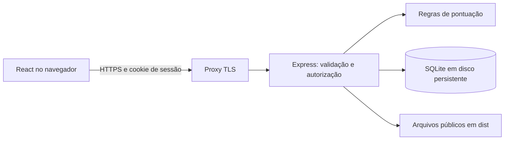
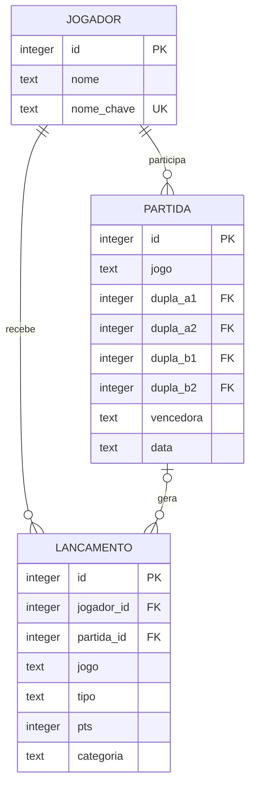

# Escolha da stack e arquitetura

Decisão inicial em 11/09/2026: **React + TypeScript + Vite**, **Node.js + Express + Zod**, **SQLite via better-sqlite3**, testes com **node:test + Supertest**, CSS local. A recomendação é para o porte observado e publicação em **uma instância de aplicação com disco persistente**, hipótese ainda não confirmada por uma escolha de hospedagem.

## Justificativa e alternativas

| Camada | Escolha | Motivo e alternativa |
| --- | --- | --- |
| Interface | React e TypeScript | Componentes, estado explícito e tipos compartilhados para os formulários e ranking. Vue também atenderia; não existe evidência de preferência de equipe que justifique impor outra opção. |
| Desenvolvimento/build | Vite | Servidor local e build estático; esta aplicação autenticada não apresenta requisito conhecido de SEO/SSR. Next.js é alternativa se surgir conteúdo público indexável ou preferência por um framework integrado. |
| API | Express 5 e Zod | Reaproveita o ecossistema do original e adiciona validação central. NestJS adicionaria convenções e estrutura além do necessário neste tamanho. |
| Persistência | SQLite e SQL explícito | Poucos dados, operações curtas, instalação simples em servidor único. PostgreSQL é a preferência para várias instâncias, hospedagem sem disco persistente ou alta concorrência de escrita. |
| Autenticação inicial | Administrador configurado, hash scrypt e sessão no banco | Executável sem depender de um serviço externo. Múltiplas contas, convites e SSO devem usar um provedor de identidade ou uma solução mantida, após definir o provedor corporativo. |
| Estilo | CSS local | Remove dependências de CDN em execução. Tailwind instalado localmente é uma evolução opcional conforme o volume de componentes. |
| Testes | node:test e Supertest | Exercita contratos HTTP, autorização, regras, relações e rollback com SQLite real em memória. |

A documentação oficial do [Vite](https://vite.dev/guide/) descreve os requisitos do Node e os templates React/TypeScript. O projeto fixa versões resolvidas no lockfile e foi montado no Node 22.23.1. A [documentação do SQLite](https://www.sqlite.org/whentouse.html) ressalta o limite de um escritor por vez e os cenários em que um banco cliente/servidor é preferível. A decisão de manter SQLite é uma avaliação do contexto observado, não uma garantia de capacidade sem medição.

Não escolhemos hospedagem serverless para este banco local. Se Vercel, múltiplos containers ou PostgreSQL gerenciado forem requisitos, trocar a camada de persistência é trabalho de implementação e migração, não apenas mudar uma variável.

## Fluxo

Em desenvolvimento, Vite encaminha `/api` à porta 3001. Em publicação, Express serve `dist` e `/api` no mesmo domínio, atrás de um proxy HTTPS. O processo escuta em loopback por padrão. O arquivo do banco fica fora da pasta pública.

## Modelo

Cada partida tem quatro FKs obrigatórias e distintas para jogador. Um lançamento pode ser manual (`partida_id` nulo) ou vinculado à partida. `sessao` armazena hash do token, validade e impressão da credencial; trocar a credencial invalida sessões existentes. IDs de jogador representam participantes, não contas autenticáveis nesta versão.

SQLite habilita FKs, WAL e espera de até 5 segundos por bloqueio. Migrações locais usam `user_version`: versão 1 para domínio; versão 2 para sessões. A transação síncrona evita intercalar a criação da partida com outras requisições no mesmo processo. Consultas são parametrizadas. Não há paginação no bootstrap; deve ser adicionada se o histórico crescer.

## Autenticação e limites

A senha inicial é aleatória e apenas seu hash com salt é persistido no `.env`. A derivação scrypt é assíncrona, com comparação em tempo constante do hash; a [API oficial do Node](https://nodejs.org/api/crypto.html#cryptoscryptpassword-salt-keylen-options-callback) descreve os parâmetros. Cookies usam HttpOnly, SameSite=Strict e, em produção, Secure com prefixo `__Host-`. Tokens têm 32 bytes aleatórios e apenas seu SHA-256 vai ao banco. Requisições de escrita verificam origem e JSON; não há CORS aberto. O frontend não guarda credenciais ou tokens no localStorage.

O limite inicial é global: 10 tentativas de login por janela de 15 minutos, incluindo sucessos, em memória. Isso reduz tentativas mas permite indisponibilidade temporária por abuso e reinicia com o processo. Para exposição pública, configurar também proteção no proxy e considerar um provedor de identidade com MFA. As [recomendações de segurança do Express](https://expressjs.com/en/advanced/best-practice-security.html) fundamentam TLS, cookies protegidos e redução da exposição de detalhes internos.

A base não equivale a uma solução completa de identidade: não inclui recuperação de senha, contas individuais, MFA ou trilha de auditoria. O roadmap prevê essas decisões antes de ampliar o acesso.
